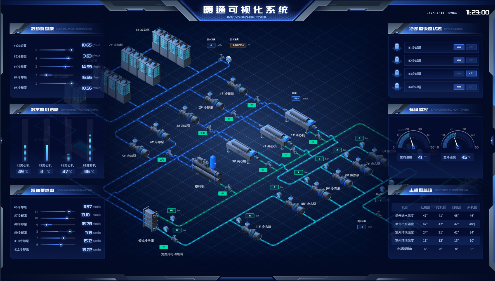
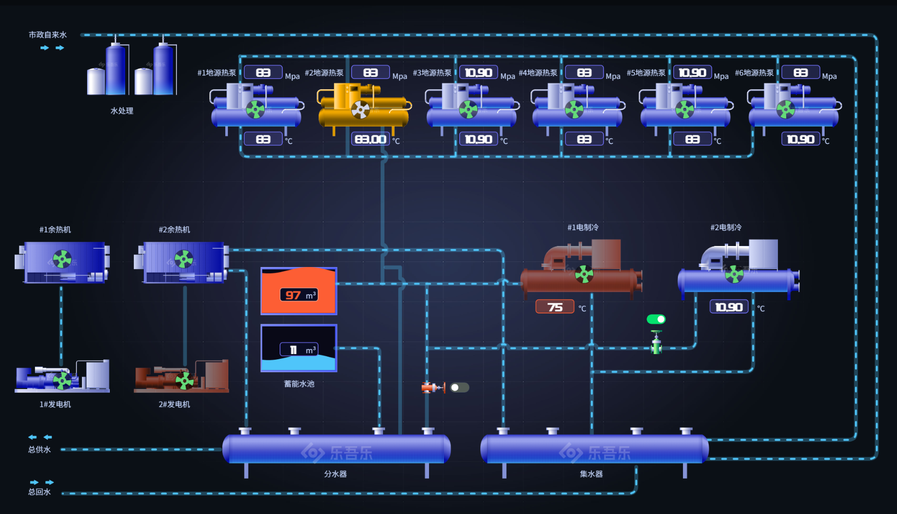
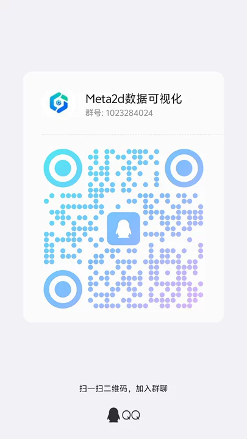

# Meta2D ThingsBoard Designer

一个基于 **Meta2D** 打造的 **2D 可视化设计器 / 监控大屏编辑器 / IoT Dashboard Designer**，支持与 **ThingsBoard 数据源对接**，可用于创建 SCADA 组态、IoT 面板、设备监控拓扑等可视化系统。

> 🚀 在线 Demo（GitHub Pages）  
> https://thexiong.github.io/meta2d-thingsboard-designer

---

## ✨ 功能特性

### 🎨 设计器能力
- 拖拽式编辑  
- 对齐、吸附、分组、复制粘贴  
- 锚点、连线、拓扑组件  
- 自定义组件（按钮、仪表、容器、图片、表单等）  
- 图层管理、撤销/重做  
- 主题配置、网格线、标尺  

### 🔌 ThingsBoard 数据对接
- 通过 WebSocket 订阅 TB 遥测数据  
- 支持设备属性、遥测绑定  
- 组件级数据自动更新  
- 支持组件触发 RPC 控制命令  

### 📦 导入导出
- 导出 JSON 
- 导出 PNG / SVG 图片

---

## 📸 效果截图（来自meta2d官方模板截图）

---

## 联系方式

